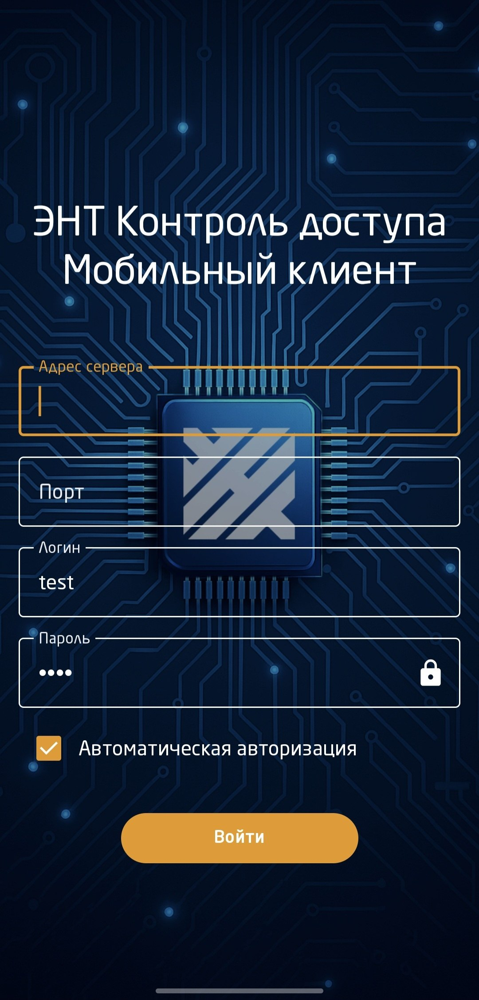
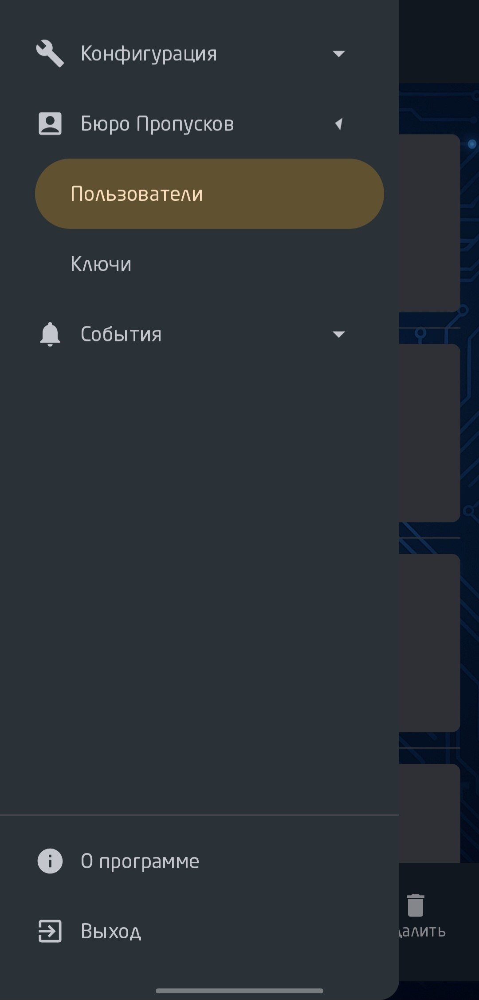
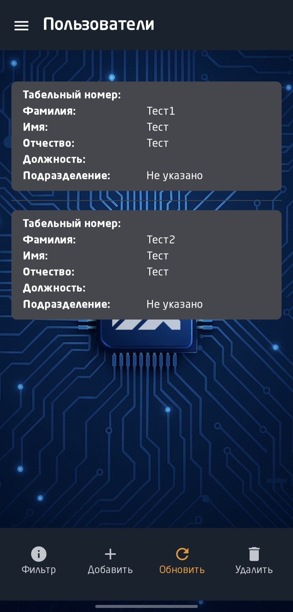
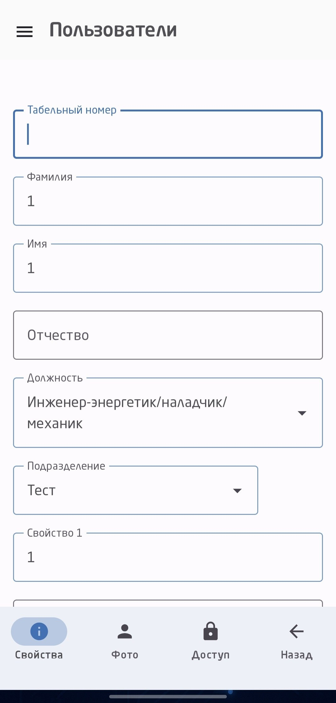
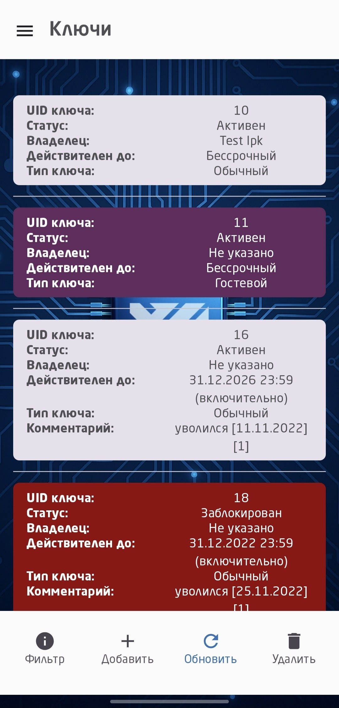
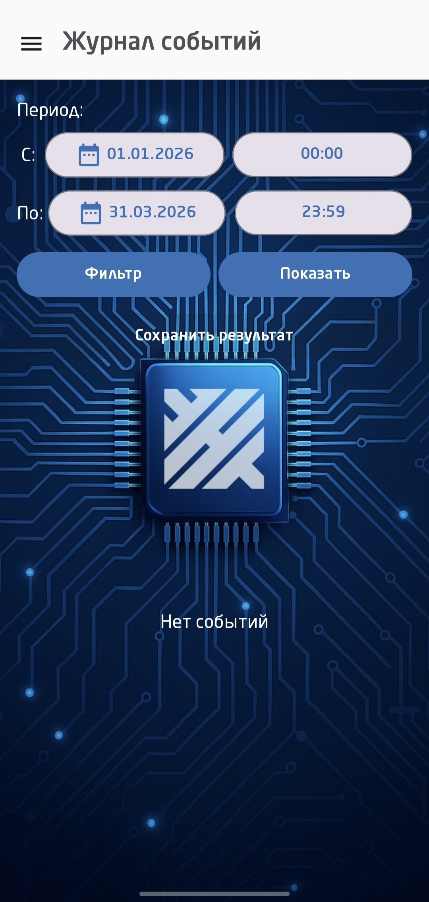

# KMP Access Control Client Demo

Демо-версия KMP-клиента, основанная на архитектуре коммерческого проекта.
На данный момент реализована только Android-часть.
Из репозитория удалены рабочие API-адреса, бизнес-данные, внутренние протоколы и часть production-логики.

Цель проекта — показать архитектуру, работу с KMP, Compose Multiplatform, Ktor, Koin, MVVM, авторизацией, сетевым слоем и разделением на data/domain/presentation.

## Screenshots

  
  
  

  
  
  

